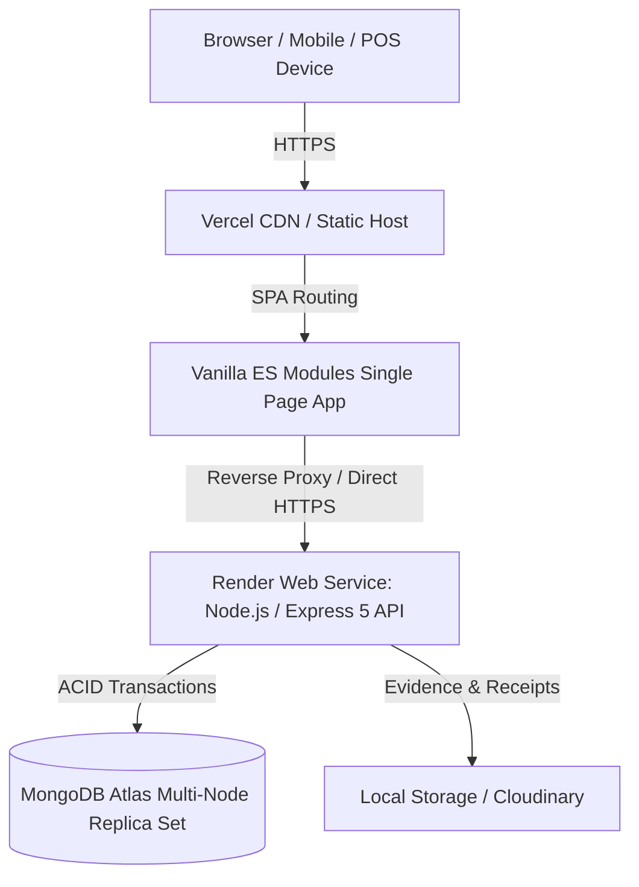

# ☕ Zamorin Cafe ERP — Enterprise Management Platform

[](https://github.com/zamorinestate-erp/estate-erp/actions/workflows/ci.yml)
[](https://github.com/zamorinestate-erp/estate-erp/actions/workflows/deploy-check.yml)
[](https://nodejs.org/)
[](https://www.mongodb.com/atlas)
[](https://vercel.com/)
[](https://render.com/)

---

## 📖 Overview

**Zamorin Cafe ERP** is a full-featured, zero-build restaurant and enterprise resource planning system designed for multi-branch cafe operations, workforce governance, inventory lifecycle management, POS billing, and real-time revenue sharing.

### 🌟 Key Highlights
- **28 Core Business Modules**: Command Centre, POS & Till, Inventory, Department Orders, Shift Roster, Payroll, Expense Policies, Financial Ledgers, and Multi-Cafe Governance.
- **Role-Based Access Control (RBAC)**: Enforced across 4 distinct user personas (`MASTER`, `OWNER`, `CAFE_ADMIN`, `STAFF`) with step-up MFA and cryptographic session binding.
- **Zero-Build Vanilla ES Modules Frontend**: Ultra-fast asset loading, zero bundling overhead, service worker offline caching, and responsive cross-device layouts.
- **ACID Transaction Engine**: Multi-document transactional integrity powered by MongoDB Atlas replica sets.

---

## 🏛️ System Architecture



---

## 🚀 Quick Deployment Guide

### 1. 🗄️ MongoDB Atlas (Database)
1. Log in to [MongoDB Atlas](https://cloud.mongodb.com) and create a **Cluster** (M0 Free or Dedicated M10+).
2. Go to **Network Access** $\rightarrow$ Add IP Address:
   - Allow `0.0.0.0/0` (with strong password) or add your Render instance's outbound IP.
3. Go to **Database Access** $\rightarrow$ Add Database User (e.g., `zamorin_admin`) with `readWriteAnyDatabase` or `readWrite` privileges on `zamorin_production`.
4. Copy the connection string:
   ```
   mongodb+srv://<username>:<password>@cluster0.xxxxx.mongodb.net/zamorin_production?retryWrites=true&w=majority&appName=ZamorinCafeERP
   ```

---

### 2. ⚡ Render (Backend API Service)
Deploy via Render Blueprint or standard Web Service:

1. Link your GitHub repository in **[Render.com](https://render.com)**.
2. Select **New Blueprint Instance** (or create a Web Service pointing to `backend/` directory).
3. Set the following Environment Variables:

| Environment Variable | Description | Example / Required Value |
| :--- | :--- | :--- |
| `NODE_ENV` | Runtime environment | `production` |
| `PORT` | Service port (Render provides automatically) | `4000` |
| `TZ` | Timezone | `Asia/Kolkata` |
| `MONGODB_URI` | MongoDB Atlas Connection String | `mongodb+srv://<db_user>:<db_password>@cluster.mongodb.net/zamorin_production?...` |
| `ALLOWED_ORIGINS` | Permitted Frontend URLs | `https://your-frontend.vercel.app,https://yourdomain.com` |
| `JWT_ACCESS_SECRET` | Cryptographic secret for access tokens | Random string $\ge 32$ chars |
| `MFA_ENCRYPTION_KEY` | Hex encryption key for MFA tokens | 64-character hex string |
| `INITIAL_ORGANISATION_ID`| Default Organization ID | `ZAMORIN` |
| `INITIAL_MASTER_EMAIL` | Initial Master Admin login email | `admin@zamorincafe.com` |
| `INITIAL_MASTER_PASSWORD`| Initial Master Admin password | Strong password ($\ge 8$ chars) |
| `PRIVATE_STORAGE_DRIVER`| Storage provider for files/receipts | `local` (or `cloudinary`) |

4. Deploy service. On boot, `startProd.js` will automatically and idempotently seed the primary master, permissions, roles, and default categories into MongoDB Atlas.
5. Verify health: `https://<your-render-backend>.onrender.com/api/v1/health`

---

### 3. ▲ Vercel (Frontend SPA)
1. Import your GitHub repository in **[Vercel Dashboard](https://vercel.com/new)**.
2. Project Settings:
   - **Framework Preset**: `Other`
   - **Root Directory**: `frontend` (or `./` with provided root `vercel.json`)
   - **Build Command**: Leave empty (or `echo 'zero build'`)
   - **Output Directory**: `.`
3. In `frontend/vercel.json`, update the proxy target to point to your live Render backend URL:
   ```json
   { "source": "/api/(.*)", "destination": "https://<YOUR-RENDER-BACKEND>.onrender.com/api/$1" }
   ```
4. Deploy! Your Vercel frontend is live with automatic SSL, caching, and SPA routing.

---

### 4. 🐙 GitHub (CI/CD & Source Control)
- **Continuous Integration (`.github/workflows/ci.yml`)**: Automatically triggers on every push and PR to `main`/`master` to run JavaScript syntax validation, test suites, router integrity audits, and 28-module verification.
- **Deployment Auditing (`.github/workflows/deploy-check.yml`)**: Pre-flight validation ensuring server syntax, blueprints, and invariants are 100% verified.

---

## 🛠️ Local Development

### Prerequisites
- Node.js **v20.x or higher**
- Local MongoDB Replica Set or MongoDB Atlas connection

### Setup
```bash
# Clone repository
git clone https://github.com/zamorinestate-erp/estate-erp.git
cd estate-erp

# Install root & backend dependencies
npm ci
cd backend && npm ci && cd ..

# Copy environment template
cp backend/.env.example backend/.env

# Run pre-flight configuration audit
npm run check

# Start all services concurrently (Frontend on :3000, Backend on :4000)
npm run dev
```

---

## 🧪 Testing & Invariant Validation

```bash
# Run backend regression test suite
npm run test:backend

# Run frontend module & router verification
npm run test:frontend

# Run 28-module master system verification engine
npm run verify

# Run pre-flight deployment configuration diagnostic
cd backend && npm run check:deploy
```

---

## 🔒 Security & RBAC Governance
- **Zero Invariant Violations**: Fail-closed architecture prohibits unauthorized role step-ups.
- **HttpOnly Cookies**: Anti-CSRF origin enforcement and strictly secured tokens.
- **Strict CORS Policy**: No wildcard origins permitted in production.

---

## 📄 License
UNLICENSED — Proprietary & Confidential to Zamorin Cafe Operations Engineering.
