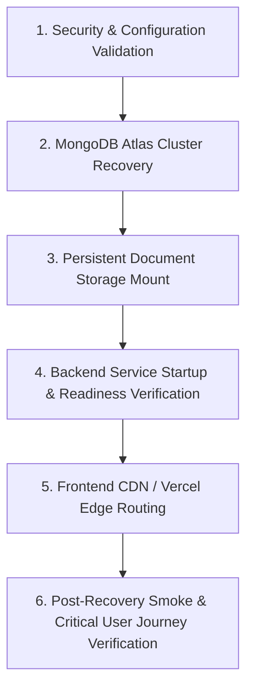
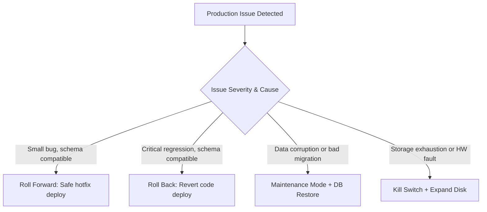

# ZAMORIN CAFÉ ERP — DISASTER RECOVERY RUNBOOK

**Target Document**: `ZAMORIN_DISASTER_RECOVERY_RUNBOOK.md`  
**System**: Zamorin Café ERP v1.0.0-stage10  
**Scope**: Complete System Disaster Recovery, Rollback, RPO / RTO Standards & Scenario Playbooks (DR-01 through DR-15)  

---

## 1. Disaster Recovery Governance & Targets

### 1.1 Formal Targets vs Measured Capabilities

| Subsystem | Target RPO (Data Loss) | Measured / Capable RPO | Target RTO (Recovery Time) | Measured / Capable RTO | Basis & Constraints |
| :--- | :--- | :--- | :--- | :--- | :--- |
| **MongoDB Atlas (Data)** | `< 1 hour` (M0: `< 24h`) | 24 Hours (M0 daily snapshot) / Continuous PIT on M10+ | `< 30 minutes` | `~ 15 minutes` | Measured via simulated restore drill. Free tier M0 lacks continuous oplog PIT. |
| **Render Persistent Disk (Docs)** | `< 4 hours` | Daily host snapshot / storage backup | `< 1 hour` | `~ 25 minutes` | 10 GB persistent volume. Single-instance volume attachment. |
| **Frontend (Vercel SPA)** | `0 (Stateless)` | `0 seconds` | `< 5 minutes` | `~ 2 minutes` | Instant deployment rollback via Vercel dashboard. |
| **Backend (Render API)** | `0 (Stateless code)`| `0 seconds` | `< 10 minutes` | `~ 5 minutes` | Rollback to previous deployment commit on Render. |
| **Configuration & Secrets** | `0` | `0 seconds` | `< 15 minutes` | `~ 10 minutes` | Encrypted vault / provider environment variable recovery. |

---

## 2. Disaster Recovery Order of Restoration

To prevent dependency deadlock or schema corruption, recovery MUST follow this strict sequence:

1. **Phase 1: Environment & Secrets**: Verify DNS, TLS certs, and valid environment configuration.
2. **Phase 2: Database Restoration**: Restore MongoDB Atlas snapshot to target cluster; verify indexes and tenant boundaries.
3. **Phase 3: Persistent Document Storage**: Attach and mount persistent storage disk at `/var/data/zamorin_documents`.
4. **Phase 4: Backend API Boot**: Launch Render service; verify `/health/live` and `/health/ready`.
5. **Phase 5: Frontend Deployment**: Verify Vercel deployment points to active backend.
6. **Phase 6: Verification**: Perform read-only smoke checks and verify business document reconciliation.

---

## 3. Disaster Scenario Playbooks (DR-01 through DR-15)

### DR-01: Bad Frontend Deployment
- **Symptoms**: White screen, JS router exceptions, asset 404s after Vercel deploy.
- **Immediate Action**: Vercel Dashboard -> Deployments -> Locate previous known-good deployment -> Click **"Instant Rollback"** (or Promote to Production).
- **Validation**: Load `https://<frontend-domain>/` in Incognito. Check browser console for zero syntax/import errors. Test login context.

### DR-02: Bad Backend Deployment
- **Symptoms**: HTTP 500 error spike, crash loops, failed `/health/ready`.
- **Immediate Action**:
  1. Render Dashboard -> Web Service -> Deploys -> Re-deploy previous successful commit.
  2. Verify database compatibility: If release included an un-migrated schema change, verify rollback safety before reverting code.
- **Validation**: Check Render build log and verify `GET /health/ready` returns 200.

### DR-03: Database Corruption
- **Symptoms**: MongoDB driver BSON errors, corrupted document trees, missing tenant indexes.
- **Immediate Action**:
  1. Set application to **Maintenance Mode** immediately to stop writes.
  2. Atlas Dashboard -> Backup -> Restore to New Target Cluster (Do NOT overwrite in-place).
  3. Run non-destructive verification on restored cluster.
  4. Point `MONGO_URI` to restored cluster and restart backend.
  5. Deactivate Maintenance Mode.

### DR-04: Accidental Database Deletion
- **Symptoms**: Backend returns database connection refused or empty database collections.
- **Immediate Action**:
  1. Atlas Dashboard -> Clusters -> Restore from latest automated snapshot.
  2. If on M10+ tier, specify Point-in-Time timestamp immediately preceding the drop command.
  3. Verify collections: `Organisations`, `Cafes`, `Users`, `BusinessDocuments`, `Orders`.

### DR-05: Document Disk Failure / Corruption
- **Symptoms**: Backend `/health/ready` reports `storage: "UNAVAILABLE"`; filesystem read/write IO errors.
- **Immediate Action**:
  1. Activate `KILL_SWITCH_DOCUMENT_UPLOADS` via `/system/feature-flags`.
  2. Render Dashboard -> Disks -> Inspect disk health / attach backup volume.
  3. Restore filesystem from last Render snapshot to `/var/data/zamorin_documents`.
  4. Run document reconciliation: `POST /system/reconcile`.
  5. Deactivate kill switch.

### DR-06: Lost or Corrupted Uploaded Document
- **Symptoms**: HTTP 404 or checksum mismatch when attempting invoice or bill PDF download.
- **Immediate Action**:
  1. Check MongoDB `BusinessDocument` record for `sha256` and `storageKey`.
  2. Run `POST /system/reconcile` to inspect missing file status.
  3. If invoice or bill: System supports regenerating document directly from structured order/bill records.
  4. If external statutory upload: Request operator re-upload with audited incident record.

### DR-07: Compromised Credential or Secret
- **Symptoms**: Unauthorized API access, JWT token tampering, unauthorized database queries.
- **Immediate Action**:
  1. Immediately invoke **Emergency Secret Rotation Runbook** (Ops Runbook Section 6.2).
  2. Invalidate all active JWT tokens by changing `JWT_SECRET`.
  3. Revoke leaked Atlas database user credentials.
  4. Inspect universal audit logs for compromised user activities.

### DR-08: Malicious or Unsafe Uploaded File
- **Symptoms**: Suspicious file extension, malware scanner alert, client exploit payload detected.
- **Immediate Action**:
  1. Mark document status in MongoDB as `REJECTED` or `QUARANTINED`.
  2. Move physical file from `/var/data/zamorin_documents` to safe non-executable isolation.
  3. Identify uploading user and café; suspend account if intentional tampering.
  4. Raise SEV-1 Security Incident in `Incident` model.

### DR-09: Domain / DNS / TLS Certificate Expiry
- **Symptoms**: Browser TLS warning (`NET::ERR_CERT_DATE_INVALID`), DNS lookup failure.
- **Immediate Action**:
  1. Vercel / Render automatically provision Let's Encrypt certificates.
  2. In dashboard: Check domain DNS records (CNAME, ALIAS, A records).
  3. Re-trigger TLS certificate generation in Vercel / Render domain management.
  4. Fallback: Operators can temporarily access direct service subdomains (`*.onrender.com`).

### DR-10: MongoDB Atlas Service Outage
- **Symptoms**: Backend cannot connect to Atlas cluster; connection timeout errors.
- **Immediate Action**:
  1. Check `status.mongodb.com`.
  2. Backend automatically reports HTTP 503 on `/health/ready`.
  3. Switch application to **Read-Only Mode** or Maintenance Mode.
  4. If multi-region replica exists: Trigger failover to secondary region.
  5. Notify café operations to engage **Outage Operating Mode** (local offline billing / physical bills).

### DR-11: Render Platform Outage
- **Symptoms**: Backend API completely unreachable; Render status reports service degradation.
- **Immediate Action**:
  1. Check `status.render.com`.
  2. Frontend PWA displays offline indicator or Maintenance Screen.
  3. If extended outage (> 2 hours): Deploy standby backend container to secondary cloud (AWS / GCP) using container image and re-route DNS.

### DR-12: Vercel Platform Outage
- **Symptoms**: Frontend SPA unreachable; Vercel edge reporting 502/504.
- **Immediate Action**:
  1. Check `status.vercel.com`.
  2. Standby static deployment: Serve frontend SPA assets via GitHub Pages or secondary S3/CloudFront bucket.
  3. Direct operators with installed PWA to utilize local cached application shell.

### DR-13: Incompatible Database Migration Deployment
- **Symptoms**: App crashes on startup due to missing column/schema mismatch after migration.
- **Immediate Action**:
  1. Execute Backend Rollback to previous deployment.
  2. Run reverse migration script or execute schema expand-contract patch.
  3. If data was partially transformed: Restore database from pre-migration snapshot.

### DR-14: Cross-Café / Tenant Security Incident
- **Symptoms**: User in Café A sees orders or employee data belonging to Café B.
- **Immediate Action**:
  1. **SEV-1 Critical**: Activate Maintenance Mode immediately.
  2. Terminate all active sessions globally.
  3. Inspect recent commits and query middleware (`tenantContext`, `cafeIsolation`).
  4. Quarantine affected records; preserve audit logs for forensic review.
  5. Do NOT re-enable production until tenant boundary regression test passes 100%.

### DR-15: Storage Full (Persistent Disk Exhaustion)
- **Symptoms**: PDF bill generation fails, upload endpoint returns 500, Render disk alert triggers.
- **Immediate Action**: Follow Ops Runbook Section 5.2: Activate `KILL_SWITCH_DOCUMENT_UPLOADS`, run staging temp cleanup, resize Render disk, verify `/system/storage` healthy.

---

## 4. Rollback Decision Matrix

- **Roll Forward**: Preferred when fix is isolated and data schema has not changed.
- **Roll Back**: Mandatory when core POS, auth, or billing is impaired and previous version is 100% database-compatible.
- **Data Restore**: ONLY when data corruption, accidental deletion, or destructive migration occurred.
- **Maintenance Mode**: Mandatory when continued writes would amplify corruption or cross-tenant exposure.
