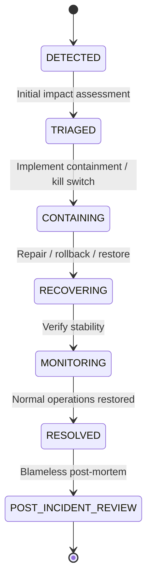

# ZAMORIN CAFÉ ERP — INCIDENT RESPONSE RUNBOOK

**Target Document**: `ZAMORIN_INCIDENT_RESPONSE_RUNBOOK.md`  
**System**: Zamorin Café ERP v1.0.0-stage10  
**Standard**: Aligned with NIST SP 800-61 Rev. 2 (Computer Security Incident Handling Guide)  

---

## 1. Incident Lifecycle & States

Every production and security incident follows this lifecycle:

### Stage Definitions
1. **DETECTED**: Automated monitoring (SEV-1/SEV-2 alert), error rate spike, or user report.
2. **TRIAGED**: Incident Commander assigned; scope, affected cafes, and severity classified.
3. **CONTAINING**: Mitigate active harm (e.g. engage Maintenance Mode, activate Kill Switch, isolate network).
4. **RECOVERING**: Execute recovery plan (code rollback, database restore, secret rotation).
5. **MONITORING**: Observe telemetry for 1 hour post-recovery; confirm error rate < 0.1%.
6. **RESOLVED**: Incident closed with documented resolution notes.
7. **POST_INCIDENT_REVIEW**: Conduct blameless retrospective; generate remediation action items.

---

## 2. Severity Classification Matrix

| Severity | Description | Criteria & Examples | Target Response Time | Escalation Contact |
| :--- | :--- | :--- | :--- | :--- |
| **SEV-1 (Critical)** | Catastrophic impact on operations or security | Global outage, database down, active cross-tenant leak, malware upload, billing completely broken. | `< 15 minutes` | Primary Master, CTO, Lead Architect |
| **SEV-2 (High)** | Severe degradation of major functionality | Specific café offline, export pipeline failing, backup job failure, disk > 85% full. | `< 1 hour` | Café Owner, Systems Engineer |
| **SEV-3 (Medium)** | Degraded performance or non-critical issue | Slow query alerts, single background job error, minor UI glitch on non-critical view. | `< 4 hours` | On-call Engineer |
| **SEV-4 (Low / Info)**| Minor administrative or informational anomaly | Certificate renewed, planned maintenance completed, routine audit discrepancy. | Next business day | Operations Team |

---

## 3. Incident Management & Evidence Preservation

### 3.1 Security & Audit Rules
- **NEVER paste secrets, tokens, passwords, or customer PII into incident records**.
- Correlate incidents using `X-Request-ID` and `X-Correlation-ID`.
- Universal audit logs are append-only. Do NOT delete or modify audit collections during or after an incident.
- Preserve database snapshots and log streams for forensic investigation before applying destructive fixes.

### 3.2 Role Responsibilities
- **Incident Commander (IC)**: Leads triage, coordinates recovery, authorizes kill switches / maintenance mode.
- **Operations Lead**: Executes rollback, database restore, or infrastructure scaling.
- **Communications Lead**: Updates café owners and operational staff; provides status updates every 30 minutes for SEV-1.

---

## 4. Incident Response Playbook Templates

### Template A: SEV-1 Service Outage / Crash Loop
1. **Detection**: Render reports container crash or `/health/ready` returns 503.
2. **Containment**:
   - Notify staff: "System investigating outage, engage offline billing."
   - Check Render logs for fatal error / unhandled rejection.
3. **Recovery**:
   - If caused by recent deploy: Trigger instant Render rollback.
   - If caused by Atlas connection: Check Atlas cluster status and connection pool.
4. **Validation**: Verify `/health/live` and `/health/ready` return 200. Run read-only smoke checks.
5. **Closure**: Log incident in `Incident` model with root cause.

### Template B: Suspected Cross-Tenant Data Access
1. **Detection**: Audit log alert: User from Café A attempted or succeeded query for Café B resources.
2. **Containment**:
   - **Immediately engage Maintenance Mode** via `/api/v1/system/maintenance`.
   - Invalidate user session tokens.
3. **Eradication**:
   - Inspect query filters in affected controller. Verify tenant scoping middleware is strictly enforced.
   - Patch code and execute regression test suite.
4. **Recovery**:
   - Deploy verified fix.
   - Deactivate Maintenance Mode.
5. **Post-Mortem**: Determine if unauthorized data was exfiltrated; inform affected stakeholders per statutory compliance.

### Template C: Malware or Unsafe Upload Detection
1. **Detection**: Malware scanner flags uploaded attachment or suspicious payload rejected.
2. **Containment**:
   - Prevent file download: Ensure status is `REJECTED` or `QUARANTINED`.
   - Quarantine storage key.
3. **Eradication**: Remove infected binary from staging/storage.
4. **Recovery**: Audit uploading user and IP; inspect other documents uploaded by same entity.
5. **Closure**: Record hash, upload timestamp, and quarantine resolution.
