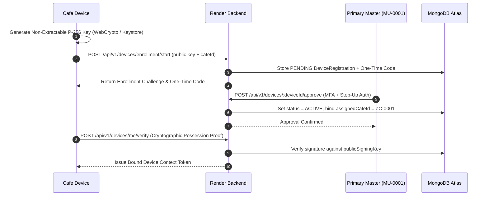

# ZAMORIN CAFE ERP — DEVICE-BOUND DATA SEPARATION & DEVICE-AWARE AUTHORIZATION ARCHITECTURE

**DOCUMENT CLASSIFICATION**: SECURITY ARCHITECTURE & SYSTEM SPECIFICATION  
**VERSION**: `v1.2.0-dsec`  
**STATUS**: APPROVED ARCHITECTURAL SPECIFICATION  
**DATE**: 2026-08-15  

---

## 1. Executive Overview & Core Principle

Zamorin Cafe ERP enforces **Device-Aware Multi-Dimensional Authorization** as an orthogonal security dimension alongside the frozen 4-role model (`MASTER`, `OWNER`, `CAFE_ADMIN`, `STAFF`). 

```
Effective Access = User Role ∩ Device Policy ∩ Cafe Assignment ∩ Resource Scope ∩ Session Assurance
```

### The Primary Security Invariant
> **`CAFE_ADMIN` + `PERSONAL` Device $\Rightarrow$ `SELF_ONLY` Effective Privilege Profile.**  
> **`CAFE_ADMIN` + Registered Active `CAFE_OWNED` Device Bound to Café $\Rightarrow$ `CAFE_OPERATIONS` Effective Profile.**

A human user with the database role `CAFE_ADMIN` operating from a personal smartphone or unverified browser is automatically clamped to self-service functionality (own attendance, own profile, own salary advance requests). Under no circumstances are employee rosters, POS billing, cash drawer balances, raw material stock levels, or supplier operations delivered or accessible on personal hardware.

---

## 2. Four-Role Architecture & Device Context Intersect

The 4-role model remains strict and immutable:
1. **`MASTER`**: Organisation-wide governance, Master approvals, Personal Ledger access.
2. **`OWNER`**: Strategic organisation-wide visibility, executive financial reporting.
3. **`CAFE_ADMIN`**: Operational management of assigned cafes when operating on verified `CAFE_OWNED` hardware.
4. **`STAFF`**: Self-service only across all devices.

```
┌─────────────────┬──────────────────┬──────────────────────────────────────────────────────────┐
│ Canonical Role  │ Device Context   │ Effective Privilege Profile & Allowed Scope              │
├─────────────────┼──────────────────┼──────────────────────────────────────────────────────────┤
│ MASTER          │ ANY / TRUSTED    │ ORGANISATION_GOVERNANCE (Full Master Authority + MFA)    │
│ OWNER           │ ANY / TRUSTED    │ STRATEGIC_EXECUTIVE_READ (Organisation summaries, No PL) │
│ CAFE_ADMIN      │ CAFE_OWNED (ZC-1)│ CAFE_OPERATIONS (Bound to ZC-0001 only: POS, Stock, Roster)│
│ CAFE_ADMIN      │ PERSONAL         │ SELF_ONLY (Clamped: Own Attendance, Own Profile only)    │
│ STAFF           │ PERSONAL         │ SELF_ONLY (Own Attendance, Own Profile, Own Advance)     │
│ STAFF           │ CAFE_OWNED       │ SELF_ONLY (Own Attendance via kiosk/personal scan)       │
└─────────────────┴──────────────────┴──────────────────────────────────────────────────────────┘
```

---

## 3. Server-Side Data Residency & Client Isolation

1. **Authoritative Datastore**: MongoDB Atlas (Replica Set, AWS Mumbai `ap-south-1`) remains the sole server-side authoritative record store.
2. **Zero-Residency on Personal Clients**:
   * Personal devices never receive café operational JSON payloads (prevented via backend middleware query-level guards).
   * Service workers strictly exclude `/api/*` endpoints from Cache Storage.
   * Personal IndexedDB persists only minimal pending attendance submission envelopes (`idempotencyKey`, `challengeEnvelope`, `scannedAtClient`).
3. **Fail-Closed Principle**: If a session lacks cryptographically verified `CAFE_OWNED` proof, the backend defaults to `deviceClass = PERSONAL` and `privilegeProfile = SELF_ONLY`.

---

## 4. Cryptographic Device Registration Lifecycle



---

## 5. Middleware Pipeline & Evaluation Order

To guarantee no controller or route bypasses device-level checks, the authorization pipeline executes in strict sequence:

```
1. Authenticate Human Identity (JWT / Session Token)
   ↓
2. Validate Session State & Version (Revocation / Password Version Check)
   ↓
3. Validate Cryptographic Device Context (DeviceRegistration Lookup)
   ↓
4. Derive Effective Privilege Profile (SELF_ONLY vs CAFE_OPERATIONS)
   ↓
5. Apply Hard Role Permissions (Canonical RBAC 95 Rules)
   ↓
6. Apply Device-Class & Bound-Cafe Scope Guards
   ↓
7. Execute Database Query with Enforced Tenant/Cafe/User Filter
   ↓
8. Field-Level Serializer & Sanitization
   ↓
9. Return HTTP Response (with Cache-Control: no-store, private)
```
