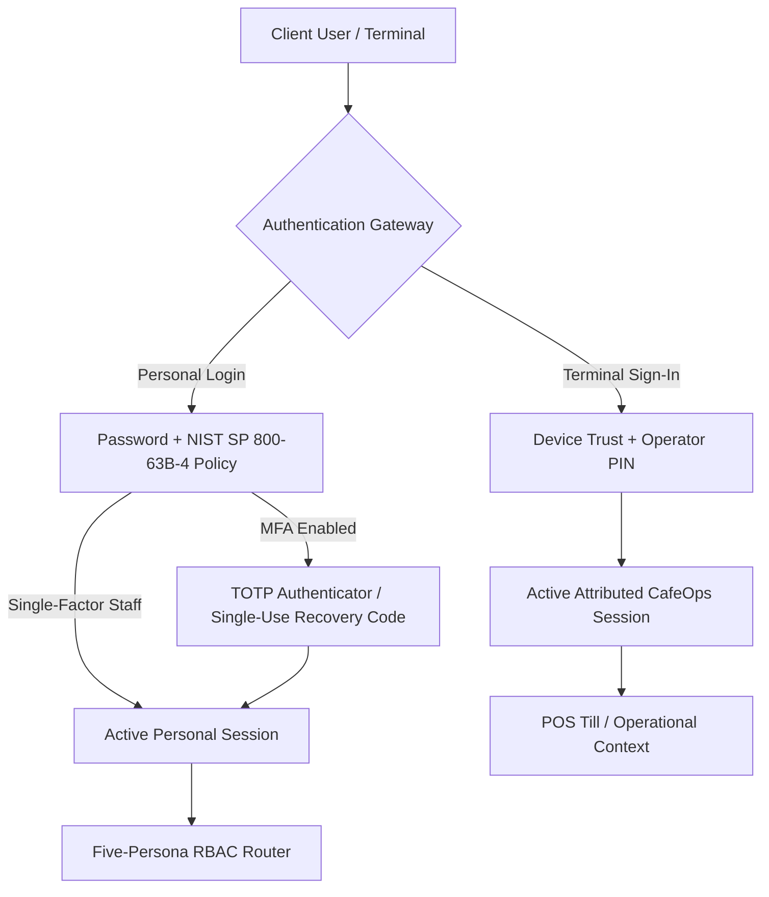

# ZAMORIN CAFÉ ERP
## LOGIN MODULE INTEGRATION PROGRAMME
## FINAL AUTHENTICATION ARCHITECTURE RECORD

---

### 1. Architectural Overview

Zamorin Café ERP implements a unified, defense-in-depth authentication and session management architecture supporting five operational personas across personal browser sessions and device-bound physical café POS terminals.

---

### 2. Core Cryptographic Subsystems

1. **Password Authentication & Modern Memory-Hard KDF**:
   - **Canonical Scheme**: Memory-hard `scrypt` (`$scrypt$v=1$N=65536,r=8,p=1`) with 128-bit CSPRNG salt and 512-bit key.
   - **Legacy & Intermediate Migration**: Version-aware verifier supporting legacy raw bcrypt (`$2b$`) and intermediate `$v2$` with transparent on-login upgrade.
   - **Policy**: Minimum 15 characters (single factor) / 8 characters (MFA-enforced), maximum 128 characters, passphrases and Unicode with NFC normalization, 0 mandatory composition rules, offline common password blocklist. Zero 72-byte truncation. Zero password-shucking risk.
2. **Multi-Factor Authentication (MFA)**:
   - **Algorithm**: RFC 6238 TOTP (SHA1, 6 digits, 30s step, drift window ±1).
   - **Storage**: Secret key encrypted at rest with `AES-256-GCM` using `MFA_ENCRYPTION_KEY` environment key.
   - **Recovery Codes**: 10 single-use codes (128 bits entropy each), stored as `SHA-256` digests at rest, consumed atomically upon use.
3. **Session & Token Management**:
   - **Access Tokens**: Short-lived JWT (15-minute TTL) containing identity claims, user session version, and permissions version.
   - **Refresh Tokens**: Opaque 64-byte Base64URL cryptographically secure tokens with single-flight rotation and automatic family revocation upon replay detection.
   - **Session Lifetimes**: Inactivity timeout (5 minutes on terminal), absolute lifetime (12 hours server-enforced).
4. **Terminal Device Trust**:
   - **Enrollment**: Single-use Crockford Base32 enrollment codes (15-minute TTL) authorized by Primary Master.
   - **Attribution**: Terminal requests bound to `device.cafeId` and `operator.userId`. Client-spoofed café parameters are ignored.
   - **Lock / Unlock**: Inactivity automatically locks DOM and session; unlock requires operator PIN re-verification.
5. **Auditing & Immutability**:
   - **AuditEvent Model**: Database-level write-only immutability (deletions and updates strictly throw exceptions).
   - **Zero Secret Leakage**: Passwords, PINs, TOTP secrets, recovery codes, and JWT tokens are 100% excluded from logs and audit records.
