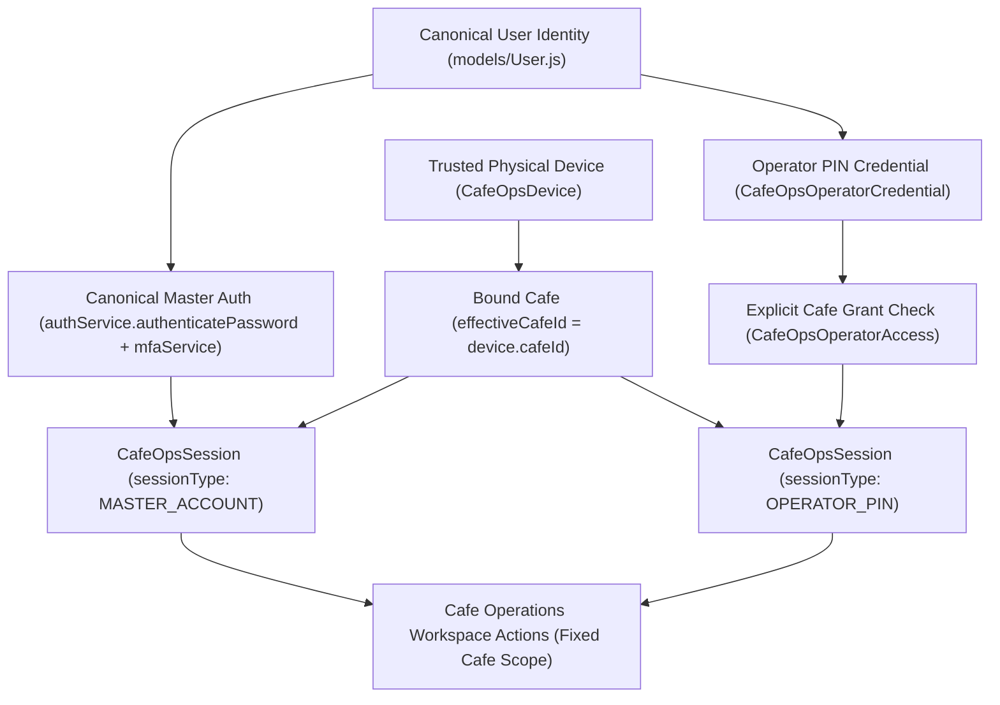

# Zamorin Café ERP — Login Integration Programme
# Stage 3 Auth & Session Architecture Reconciliation

## 1. Subordinate Terminal Session Layer (Model A Verification)

The Cafe Operations module operates strictly as a **subordinate café-terminal authorization/session layer (Architecture A)** and **NOT** as a parallel or independent personal authentication system.

---

## 2. Distinction: Personal User Session vs. Cafe Operations Terminal Session

| Property | Canonical Personal User Session (`models/Session.js`) | Cafe Operations Terminal Session (`models/CafeOpsSession.js`) |
|---|---|---|
| **Actor Context** | Individual human using personal device / web browser | Physical shared cafe terminal / counter POS |
| **Authentication** | Direct password + TOTP or WebAuthn | Operator 6-digit PIN OR Master password + TOTP |
| **Workspace Scope** | User's global or assigned tenant / role scope | Strictly locked to physical device (`effectiveCafeId = device.cafeId`) |
| **Authority Minted** | Issues canonical access/refresh tokens (`req.auth`) | Issues device-bound session token (`req.cafeOpsSession`) |
| **Elevation Risk** | Standard personal role permissions | **Zero elevation**: Master has org authority but operates in locked cafe scope; Operator has cafe scope only. |

---

## 3. CafeOpsSession Model Audit

### Schema Fields & Invariants
- `sessionCode`: Random cryptographically secure 12-char identifier.
- `sessionTokenHash`: SHA-256 hash of the opaque 256-bit session token.
- `sessionType`: Discriminator enum (`OPERATOR_PIN` | `MASTER_ACCOUNT`).
- `workspaceMode`: Fixed to `'CAFE_OPERATIONS'`.
- `actorEmployeeId`: References canonical `User.userId` / `User._id`.
- `actorRole`: Permanent role of the human (`CAFE_ADMIN`, `MASTER_PRIMARY`, `MASTER_NORMAL`). Never rewritten.
- `effectiveCafeId`: Opaque string copied unconditionally from `device.cafeId`.
- `deviceId`: References `CafeOpsDevice.id`.
- `authMethod`: Enum (`PIN`, `MASTER_PASSWORD`, `MASTER_PASSWORD_MFA`).
- `status`: Lifecycle status (`ACTIVE`, `LOCKED`, `ENDED`, `EXPIRED`).
- `startedAt`, `lastActivityAt`, `lockedAt`, `endedAt`, `endReason`.

**Invariant Confirmation**: `CafeOpsSession` does NOT contain JWT signing keys, refresh token families, or any mechanism to mint generic unrestricted personal web sessions.
