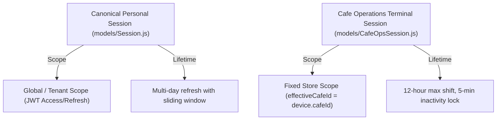

# Zamorin Café ERP — Login Integration Programme
# Stage 3 Session Model Parity Matrix

## 1. Session Hierarchy & Architecture

---

## 2. Parity Table

| Dimension | `models/Session.js` | `models/OperatorSession.js` | `models/CafeOpsSession.js` |
|---|---|---|---|
| **Domain** | Personal Web / API | Legacy Operator Till | Unified Cafe Operations Terminal |
| **Auth Methods** | Password + TOTP / Backup Codes | Legacy Till PIN | 6-digit bcrypt PIN / Strong Master Auth + MFA |
| **Inactivity Handling** | Server-side refresh token expiry | Client till lock | Proactive client heartbeat + server-side lazy lock |
| **Dual Actor Support** | User only | Till cashier only | Both `CAFE_ADMIN` (Operator) & `MASTER` (Auditor) |
| **Storage Token** | Signed JWT / Secure Cookie | In-memory session key | 256-bit opaque token (SHA-256 in DB, never in storage) |
