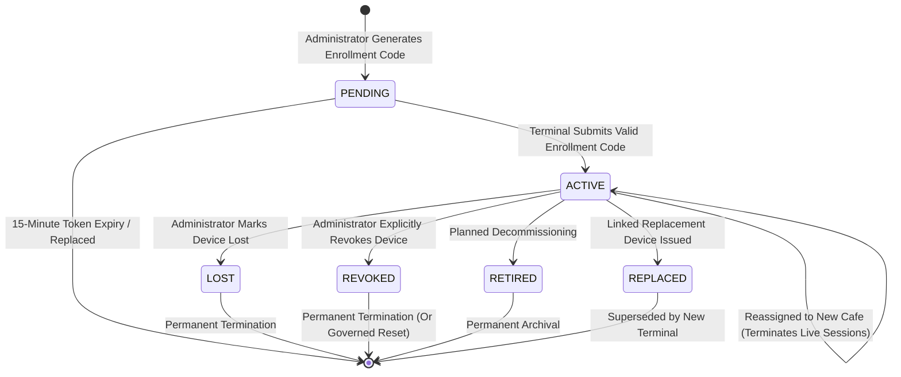

# Zamorin Café ERP — Login Integration Programme
# Stage 4 Device Lifecycle State Machine Specification

## 1. Authoritative Device States

The physical Café Operations hardware terminals operate across 6 discrete lifecycle states in `CafeOpsDevice`:

| State | Definition | Terminal Authentication Capability | Protected API Access |
|---|---|---|---|
| **`PENDING`** | Enrollment code issued by governance; waiting for hardware terminal pairing. | **BLOCKED** | **DENIED (401/403)** |
| **`ACTIVE`** | Hardware terminal enrolled, trusted, and bound to `cafeId`. | **ALLOWED** | **ALLOWED (With Active Session)** |
| **`LOST`** | Device reported lost/stolen; access immediately frozen. | **BLOCKED** | **DENIED (403 DEVICE_LOST)** |
| **`REVOKED`** | Hardware access revoked due to security incident or breach. | **BLOCKED** | **DENIED (403 DEVICE_REVOKED)** |
| **`RETIRED`** | Hardware end-of-life / decommissioned from fleet. | **BLOCKED** | **DENIED (403 DEVICE_RETIRED)** |
| **`REPLACED`** | Terminal replaced by new hardware unit; old entity archived. | **BLOCKED** | **DENIED (403 DEVICE_REPLACED)** |

---

## 2. State Transition Governance & Rules

1. **State Immutability of Inactive Devices**: Once a device enters `REVOKED`, `LOST`, `RETIRED`, or `REPLACED`, no operator or Master sign-in is permitted on that hardware.
2. **Reassignment State Behavior**: Reassigning an `ACTIVE` device from Cafe A to Cafe B terminates all live sessions, updates `cafeId = targetCafeId`, logs `DEVICE_REASSIGNED_EVENT`, and leaves the device `ACTIVE` bound to the new store.
3. **Session Invalidation Guarantee**: Any transition from `ACTIVE` to non-active (`LOST`, `REVOKED`, `RETIRED`, `REPLACED`) atomically terminates all live/locked sessions on the terminal.
