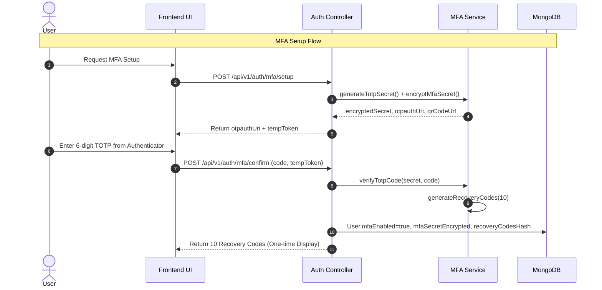
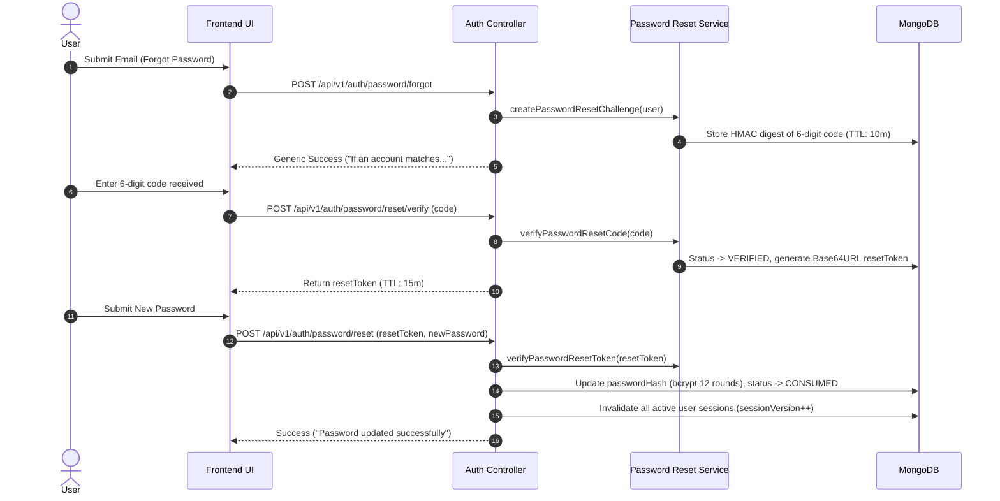

# ZAMORIN CAFÉ ERP
## LOGIN STAGE 5 — RECOVERY SECURITY ARCHITECTURE

---

### 1. Architectural Principles

1. **Zero Account Enumeration**: All public recovery endpoints return identical generic response payloads regardless of whether the submitted email exists, belongs to a disabled account, or has MFA configured.
2. **Cryptographic Token Integrity**: All reset codes (6-digit numeric) and reset tokens (Base64URL 48-byte) are derived using cryptographically secure random generation (`crypto.randomInt`, `crypto.randomBytes`).
3. **Digest-Only Persistence**: Reset codes and recovery tokens are stored only as HMAC-SHA256 digests. Plaintext values are never stored in the database or logged in telemetry.
4. **Timing-Safe Evaluation**: Verification checks utilize constant-time comparison (`crypto.timingSafeEqual`) to prevent timing side-channel attacks.
5. **Strict Time-To-Live (TTL)**:
   - Reset Code TTL: 10 minutes (`CODE_TTL_MINUTES = 10`)
   - Reset Token TTL: 15 minutes (`RESET_TOKEN_TTL_MINUTES = 15`)
   - Absolute Challenge TTL: 30 minutes (`ABSOLUTE_TTL_MINUTES = 30`)
   - Max Failed Attempts: 5 (`MAX_VERIFICATION_ATTEMPTS = 5`)
6. **Single-Use & Race-Proof Consumption**: Challenge records transition from `PENDING` -> `VERIFIED` -> `CONSUMED`. Concurrent duplicate attempts fail deterministically.
7. **Authoritative Session Invalidation**:
   - Password Reset completion revokes **all** active personal sessions and increments `user.sessionVersion`.
   - Authenticated Password Change revokes other sessions while maintaining the active session.
   - User status/role changes increment `user.permissionsVersion`, invalidating active JWT tokens upon refresh.

---

### 2. Multi-Factor Authentication (MFA) Architecture

---

### 3. Password Reset Flow Architecture

---

### 4. Canonical Password Policy

| Rule | Constraint | Server Enforcement |
|---|---|---|
| **Minimum Length** | 12 characters | `validatePasswordStrength()` rejects `< 12` |
| **Maximum Length** | 128 characters | `validatePasswordStrength()` rejects `> 128` |
| **Character Diversity** | At least 1 lowercase (`a-z`) | Regex test `/[a-z]/` |
| **Character Diversity** | At least 1 uppercase (`A-Z`) | Regex test `/[A-Z]/` |
| **Character Diversity** | At least 1 number (`0-9`) | Regex test `/[0-9]/` |
| **Character Diversity** | At least 1 special character | Regex test `/[^A-Za-z0-9]/` |
| **Algorithm** | bcrypt (cost factor 12) | `hashPassword()` via `bcrypt.hash(password, 12)` |
