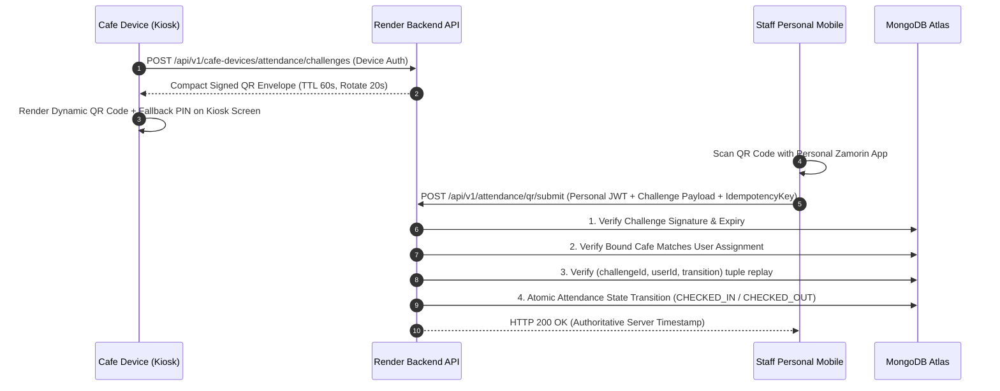

# ZAMORIN CAFE ERP — ROTATING QR ATTENDANCE SECURITY MODEL & OFFLINE PROTOCOL

**DOCUMENT CLASSIFICATION**: CRYPTOGRAPHIC PROTOCOL SPECIFICATION  
**VERSION**: `v1.2.0-qrsec`  
**DATE**: 2026-08-15  

---

## 1. Protocol Objective & Identity Decoupling

The Rotating QR challenge proves **physical presence in proximity to a registered, active café device**.
* **Identity Source**: The employee's authenticated personal mobile session (`request.auth.userId`).
* **Challenge Source**: The registered `CAFE_OWNED` device bound to `ZC-0001`.
* **Zero Employee Data in QR**: The QR contains no employee rosters, user IDs, tokens, or business configurations.



---

## 2. QR Challenge Envelope Specification

The dynamic challenge payload is serialized as a compact base64-encoded signed JSON envelope:

```json
{
  "ver": 1,
  "cid": "CHL_0191ae39b821",
  "did": "DV_ZC0001_KIOSK_01",
  "cafeId": "ZC-0001",
  "iat": 1786799800,
  "exp": 1786799860,
  "nonce": "8f39a1c0d2e4",
  "sig": "HMAC_SHA256_OR_ECDSA_P256_SIGNATURE"
}
```

### Rotation & Lifecycle Parameters
* **Visual Rotation Interval**: Every **15–30 seconds**.
* **Challenge Absolute Expiry (TTL)**: **60 seconds**.
* **Replay Protection Scope**: Multi-tenant concurrent shift start (500 staff) scanning the same displayed challenge. Replay is evaluated at the `(challengeId, userId, transition)` tuple level and `(organisationId, userId, idempotencyKey)` level.

---

## 3. Offline Attendance Protocol & Leases

### Case 1: Cafe Device Offline, Staff Mobile Online
1. The café device operates under a pre-issued, bounded **Offline Signing Lease** (valid for a maximum of 8–12 hours / one operational shift).
2. The café device signs challenges locally using its enrolled non-extractable private key.
3. The staff personal mobile submits the device-signed challenge immediately to the cloud API.

### Case 2: Both Devices Offline (No Internet Connectivity)
1. Staff personal mobile scans the café device challenge.
2. The mobile app stores the signed envelope in an isolated IndexedDB outbox:
   ```json
   {
     "queueId": "OUT_0191ae40",
     "idempotencyKey": "IDEM_0191ae40_ST0101",
     "challengeEnvelope": "<compact signed envelope>",
     "scannedAtClient": "2026-08-15T19:20:00Z",
     "state": "PENDING"
   }
   ```
3. **Deterministic Synchronization**: When connectivity resumes (or upon app foreground / login), the queue is flushed automatically via `POST /api/v1/attendance/offline/sync`.

---

## 4. Fallback Mechanisms & Manual Exceptions

1. **Rotating Short PIN Fallback**: For staff with low camera resolution or damaged lenses, the kiosk screen displays a 6-digit dynamic PIN tied to the active challenge (tightly rate-limited to 3 attempts).
2. **Audited Cafe Admin Manual Override**: If a staff member has no working mobile hardware, the `CAFE_ADMIN` on the registered `CAFE_OWNED` kiosk records attendance via `POST /api/v1/attendance/manual` requiring a mandatory reason code and generating a `MANUAL_ATTENDANCE_EXCEPTION` audit record.
